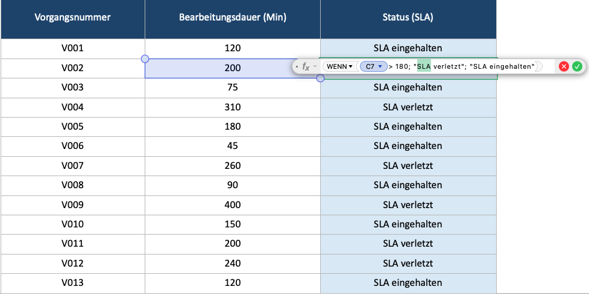
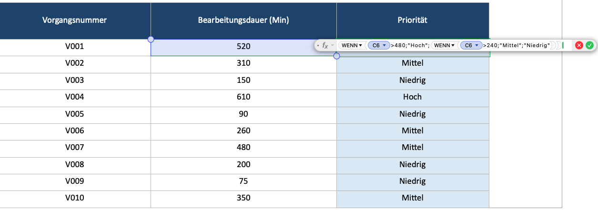
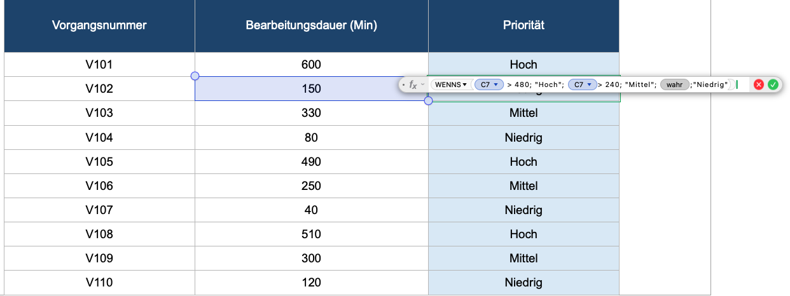
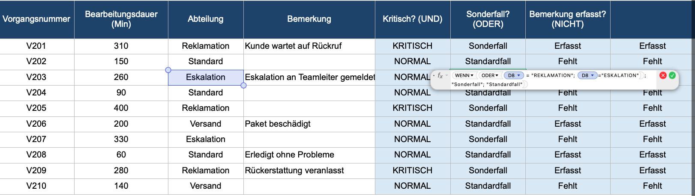
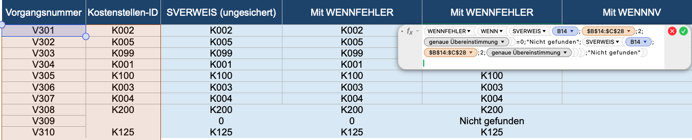

# Logik-und-Fehlerbehandlung (Auswertungen mit WENN, verschachtelter WENN, WENNS, UND/ODER/NICHT sowie WENNFEHLER)
WENN-Formel. Wenn die Bearbeitungsdauer mehr als 180 Minuten beträgt, soll 'SLA verletzt' erscheinen, sonst 'SLA eingehalten'.
Verschachtelten WENN-Formel: > 480 Min = 'Hoch', > 240 Min = 'Mittel', sonst 'Niedrig'.
Dieselbe Klassifizierung dieses Mal mit der WENNS-Funktion statt einer verschachtelten WENN.
'Kritisch', wenn Bearbeitungsdauer > 240 UND Abteilung = 'Reklamation', sonst 'Normal'.  
'Sonderfall', wenn Abteilung = 'Reklamation' ODER 'Eskalation', sonst 'Standardfall'.  
'Erfasst', wenn die Bemerkung NICHT leer ist, sonst 'Fehlt'.

## Screenshots

